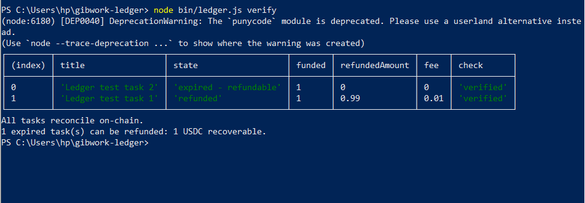
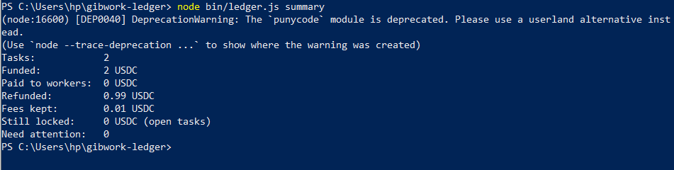
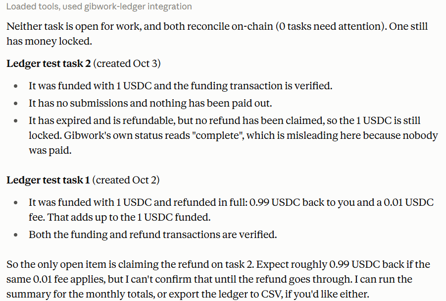

# gibwork-ledger

An audit trail for the Gibwork bounties your wallet creates. It pulls your tasks through the **Gibwork SDK**, reads the matching transactions from Solana, and checks that the two agree. You can use it from a **CLI** or through an **MCP server**, so an AI assistant can answer questions like "which of my bounties are still unpaid, and does everything reconcile on-chain?"

**Gibwork toolset used:** SDK (core), exposed through a CLI and an MCP server.

## Why it's useful

Anyone running bounties (a team, a DAO, a maintainer) needs to know where the money went. Gibwork shows task status, but not a reconciled view of what was funded, what was paid to workers, what was refunded, and what was kept in fees. This tool builds that view and flags anything that doesn't match on-chain.

Example from a real stage run: a task funded with 1.00 USDC and refunded returned 0.99 USDC. The ledger reports the 0.01 USDC difference and links both transactions.

## How it works

1. `src/gibwork.js` fetches every task your wallet created, using the Gibwork SDK.
2. `src/ledger.js` converts raw token amounts into real USDC and derives each task's true state (open, paid out, refunded, expired and refundable) from the numbers rather than trusting the status label alone.
3. `src/chain.js` reads your wallet's USDC movements from Solana.
4. `src/reconcile.js` matches each task to its funding and refund transactions and flags anything missing.
5. `bin/ledger.js` (CLI) and `src/mcp-server.js` (MCP) are two front ends over the same pipeline in `src/build.js`.

## Requirements

- Node.js 22 or newer
- A Gibwork wallet that has created tasks (stage environment is the SDK default)
- A Solana RPC endpoint (the public one works for small wallets)

## Setup

```bash
git clone <this repo>
cd gibwork-ledger
npm install
cp .env.example .env     # on Windows PowerShell: copy .env.example .env
```

Edit `.env`:

| Variable | Meaning |
| --- | --- |
| `SOLANA_PRIVATE_KEY` | Private key of the wallet that created your tasks |
| `WALLET_ADDRESS` | The same wallet's public address |
| `SOLANA_RPC_URL` | Solana RPC endpoint (default: public mainnet) |

> **Security:** use a dedicated wallet that holds only what you need for testing. Never commit `.env`; it is already in `.gitignore`.

## CLI usage

```bash
node bin/ledger.js verify
node bin/ledger.js summary [--month 2026-10]
node bin/ledger.js export [--out data/ledger.csv]
```

Sample `verify` output:

```
┌─────────┬──────────────────────┬────────────┬────────┬────────────────┬──────┬────────────┐
│ (index) │ title                │ state      │ funded │ refundedAmount │ fee  │ check      │
├─────────┼──────────────────────┼────────────┼────────┼────────────────┼──────┼────────────┤
│ 0       │ 'Ledger test task 2' │ 'open'     │ 1      │ 0              │ 0    │ 'verified' │
│ 1       │ 'Ledger test task 1' │ 'refunded' │ 1      │ 0.99           │ 0.01 │ 'verified' │
└─────────┴──────────────────────┴────────────┴────────┴────────────────┴──────┴────────────┘
All tasks reconcile on-chain.
```

Sample `summary` output:

```
Tasks:            2
Funded:           2 USDC
Paid to workers:  0 USDC
Refunded:         0.99 USDC
Fees kept:        0.01 USDC
Still locked:     1 USDC (open tasks)
Need attention:   0
```

`export` writes a CSV with one row per task, including the funding and refund transaction signatures.

## MCP usage

The server exposes three tools over stdio:

| Tool | What it does |
| --- | --- |
| `ledger_verify` | Every task with amounts, state, and on-chain reconciliation result |
| `ledger_summary` | Totals, optionally for one month (`month: "2026-10"`) |
| `ledger_export` | Writes the full ledger to a CSV in `data/` |

Test it with the MCP Inspector:

```bash
npx @modelcontextprotocol/inspector node src/mcp-server.js
```

To use it from an MCP client such as Claude Desktop, add this to its config (adjust the paths):

```json
{
  "mcpServers": {
    "gibwork-ledger": {
      "command": "node",
      "args": [
        "--env-file=C:\\path\\to\\gibwork-ledger\\.env",
        "C:\\path\\to\\gibwork-ledger\\src\\mcp-server.js"
      ]
    }
  }
}
```

Then ask: "Which of my Gibwork bounties are still open, and does everything reconcile on-chain?"

## Limitations

- **Creator side only.** The Gibwork SDK exposes tasks you created, not work you submitted as a participant.
- **Matching is by amount and timing.** The SDK's task list does not include transaction hashes, so funding and refund transactions are matched from your wallet's USDC history. Anything that cannot be matched is flagged instead of guessed.
- **Worker payout transactions are not yet matched.** Paid-out amounts come from the SDK; matching each payout to its transaction is future work.
- **USDC only.**

## Demo

- Demo video: https://drive.google.com/file/d/1EhfT0YRZYYBpyPkn5il_8av6Fs4bAhkV/view?usp=drivesdk

The demo shows the CLI catching an expired task with 1 USDC still locked, the refund being issued, and the ledger reconciling it, then the same ledger queried in plain English from Claude Desktop through MCP.

### Screenshots

**CLI `verify`: an expired task is flagged with recoverable funds**



**CLI `summary`**



**MCP: asking Claude Desktop about the ledger**




## Project structure

```
bin/ledger.js        CLI entry point
src/build.js         full pipeline (used by CLI and MCP)
src/gibwork.js       Gibwork SDK wrapper
src/ledger.js        amounts and state logic
src/chain.js         Solana transaction reader
src/reconcile.js     task-to-transaction matching
src/mcp-server.js    MCP server
```